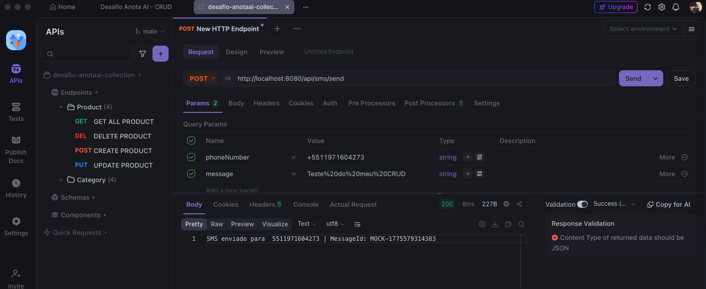
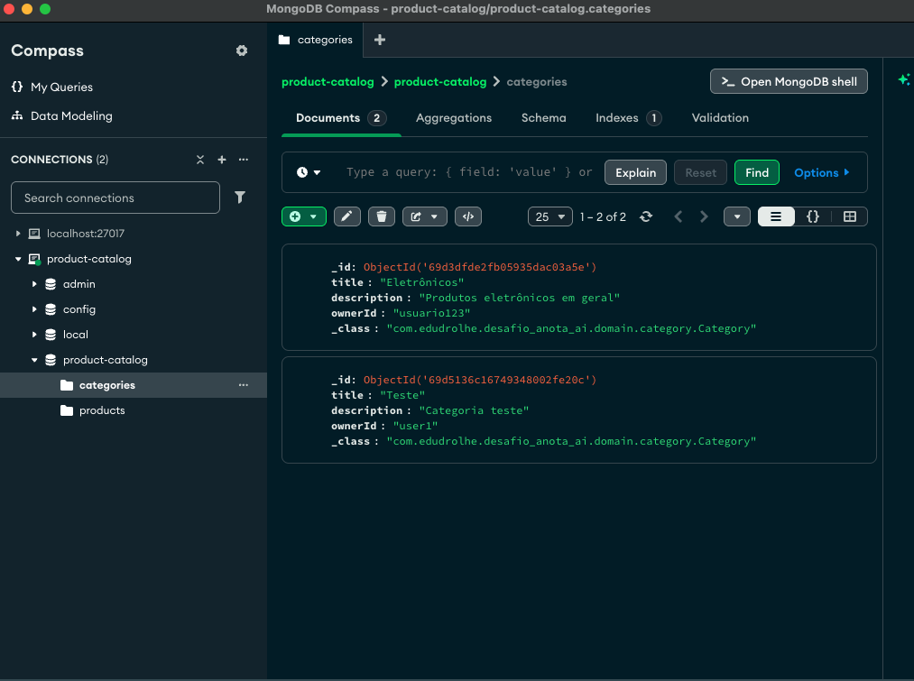

<!--suppress HtmlUnknownTarget -->
<a name="readme-top"></a>

<p align="center">
  
</p>

<p align="center">
  
  
  
  
  
</p>

---

## 📋 Sobre o Projeto

> Desafio técnico para vaga de **Backend** na **Uber**

Este projeto é uma implementação de desafio técnico para processo seletivo da Uber.

### ✔️ Funcionalidades Implementadas

- [x] Cadastro de produtos com título, descrição, preço, categoria e ownerId
- [x] Cadastro de categorias com título, descrição e ownerId
- [x] Associação de produtos a categorias
- [x] Atualização de produtos e categorias
- [x] Exclusão de produtos e categorias
- [x] Notificações via AWS SNS (SMS)

<p align="center">
  
</p>

---

## 🛠️ Tecnologias Utilizadas

| Tecnologia | Descrição |
|------------|-----------|
|  Java 17 | Linguagem de programação |
|  Spring Boot 3.4 | Framework Java |
|  MongoDB | Banco de dados NoSQL |
|  AWS SNS | Serviço de notificações |

---

## 📦 Estrutura do Projeto

```
desafio-uber/
├── src/main/java/com/edudrolhe/desafio_uber/
│   ├── config/           # Configurações AWS
│   ├── controllers/      # Endpoints REST
│   ├── domain/           # Entidades e DTOs
│   ├── repositories/     # MongoDB Repositories
│   └── service/          # Lógica de negócio
├── src/main/resources/
│   └── application.properties
├── public/              # Imagens do README
├── pom.xml
└── README.md
```

---

## 🚀 Como Executar

### Pré-requisitos

- Java 17+
- Maven 3.8+
- MongoDB (local ou Atlas)

### Comandos

```bash
# Clone o repositório
git clone https://github.com/Edudrolhe/Desafio-backend---UBER.git
cd Desafio-backend---UBER

# Compile o projeto
./mvnw clean compile

# Execute a aplicação
./mvnw spring-boot:run
```

A API estará disponível em **`http://localhost:8080`**

---

## 📡 Endpoints da API

### 📂 Categorias

| Método | Endpoint | Descrição |
|--------|----------|-----------|
| `POST` | `/api/category` | Criar categoria |
| `GET` | `/api/category` | Listar categorias |
| `PUT` | `/api/category/{id}` | Atualizar categoria |
| `DELETE` | `/api/category/{id}` | Deletar categoria |

### 📦 Produtos

| Método | Endpoint | Descrição |
|--------|----------|-----------|
| `POST` | `/api/product` | Criar produto |
| `GET` | `/api/product` | Listar produtos |
| `PUT` | `/api/product/{id}` | Atualizar produto |
| `DELETE` | `/api/product/{id}` | Deletar produto |

### 📱 SMS (Mock)

| Método | Endpoint | Descrição |
|--------|----------|-----------|
| `POST` | `/api/sms/send` | Enviar SMS |

---

## 🧪 Testando a API

### Usando ApiDog ou Postman

<p align="center">
  
</p>

**Requisição de exemplo:**

```http
POST http://localhost:8080/api/sms/send
Content-Type: application/x-www-form-urlencoded

phoneNumber=+5511999999999&message=Teste via ApiDog
```

**Resposta:**

```
SMS enviado para +5511999999999 | MessageId: MOCK-1775571815557
```

### Exemplo com curl

```bash
# Criar categoria
curl -X POST http://localhost:8080/api/category \
  -H "Content-Type: application/json" \
  -d '{"title":"Eletrônicos","description":"Produtos eletrônicos","ownerId":"user123"}'

# Criar produto
curl -X POST http://localhost:8080/api/product \
  -H "Content-Type: application/json" \
  -d '{"title":"Smartphone","description":"Smartphone premium","price":2999,"categoryId":"ID_CAT","ownerId":"user123"}'
```

---

## 📚 Referências

- [Desafio Original (Node.js)](https://github.com/githubanotaai/new-test-backend-nodejs)

---

## 📝 Licença

Este projeto está sob a licença [MIT](LICENSE).

---

<p align="center">
  Desenvolvido com ❤️ por <a href="https://github.com/eduardodrolhe">Eduardo Drolhe</a>
</p>

<p align="center">
  
</p>
